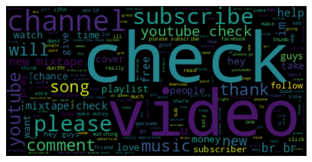

# SMS SPAM detection using NLP pipeline
Spam is unsolicited and unwanted messages sent electronically whose content may be malicious. The danger could be: exposure of pravicy, a fraud, or a virus,etc. It is a major problem for email and mobine phone users, and it is a growing problem for social media users like Youtube users. We need a solution to detect spam comments. The goal of this project is to build a model that can detect spam comments in Youtube. The dataset is from [kaggle datasets: Youtube SPAM Classified-comments](https://www.kaggle.com/datasets/goneee/youtube-spam-classifiedcomments?select=Youtube03-LMFAO.csv). It contains 5 csv files with a total of 1956 Youtube messages and is already labeled. The model is built using a NLP pipeline. 

## Dependencies
Requires [poetry](https://python-poetry.org/), whose installation instructions can be found [here](https://python-poetry.org/docs/#installing-with-the-official-installer). You also need to have right Python version installed through pyenv. Run `poetry install` to install all dependencies in the root directory of the project, where `poetry.lock` is located.

```
pyenv install 3.10.4
pyenv local 3.10.4
poetry env use 3.10.4
poetry install

```

## Usage
You can run the notebook in the root directory of the project, where `pyproject.toml` is located. 

```
poetry run jupyter notebook
```

## Analysis and Results
In this dataset, we can see  Shadrach Grentz, Hidden Love, LuckyMusiqLive, etc. leave the most spam comments. Suppringly, the spam comments are more likely to be posted on weekends.According to the wordcloud diagram and bar chart, we can see that spam messages tend to use more words like “check”, “subsribe”, “channel”, “money”, "like” etc. Those texts urge the receiver to take action.In comparison, for the ham word cloud and bar chart, those neutral verb words like “song”,”love”,”like”,”video” etc. are used mostly, more about sharing and enjoying the video.To build a prediction classification model, the dataset is split into training and test sets with 80% and 20% of the data respectively. The model is built using an NLP pipeline. The pipeline includes: tokenization, stop word removal, and stemming. Experiments on different ways to do feature engineering, including TF-IDF, word2vec, and doc2vec. The model is trained in Random Forest Classifier. The model is evaluated using precision, recall and F1 score. The best model is Random Forest on TF-IDF, with 90% F1 score, 0.95% precision, 0.83% recall on the test dataset. This model is saved as a pickle file for future use.


<!--  -->


## Project structure 
<pre>
.
├── data
│ └── spam.csv                  <- SMS spam dataset
├── scripts                     <- Experiment results folder
│   ├── util.py                 <- Functions to join,clean, tokenize text, word frequency
│   └── nlp_func.py             <- Functions to build NLP pipeline, train, test, and evaluate model
├── SMS_Spam_Classifier.ipynb   <- Notebook to load, explore, and preprocess data, create models
├── poetry.lock                 <- Poetry lock file for dependencies
├── pyproject.toml              <- Poetry project file for dependencies
├── .python-version          
├── .gitignore
└── README.md
 
</pre>

## Acknowledgements
Must give credit to [UCI Machine Learning Repository](https://archive.ics.uci.edu/ml/datasets/sms+spam+collection) for the dataset and Udacity for the code review.

