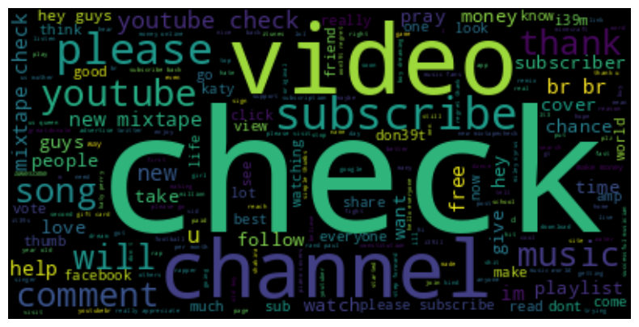

# SMS SPAM detection using NLP pipeline

Spam is unsolicited and unwanted messages sent electronically whose content may be malicious. The danger could be: exposure of pravicy, a fraud, or a virus,etc. Spam is a major problem for email users, and it is a growing problem for mobile phone users. The goal of this project is to build a model based on NLP that can detect SMS spam. 

## Dataset description

The dataset is collected from [UCI Machine Learning Repository](https://archive.ics.uci.edu/ml/datasets/sms+spam+collection), downloaded from [Kaggle: SMS Spam Collection Dataset](https://www.kaggle.com/datasets/uciml/sms-spam-collection-dataset). The dataset contains 5572 SMS messages and is already labeled. Original dataset has some nosisy information, e.g. unwanted columns, and some messages are not in English. The dataset is cleaned and preprocessed for further analysis.

## Data exploration
To understand the dataset, we first look at the distribution of spam and ham messages. The dataset is highly imbalanced, with 87% (4825 cases)
of messages being ham and 13% (747 cases) being spam. 

What are the difference of words used in spam and ham messages? We use wordcloud to visualize the most frequent words in spam and ham messages. 

The wordclouds show that spam messages tend to use more words like "free", "call", "text", "urgent", ,"cash",'prize","win" etc. Those texts promiss something for free, or urge the receiver to take action.

Meanwhile, for the ham word cloud, those neutral verb words like "call","come","go","get" etc. are used mostly. 

## Build a classification model 

### split the dataset into training and test set

 To build a prediction classification model, here firstly converted the label to binary, 1 for spam and 0 for ham. Then, we split the dataset into training and test sets. The training set contains 80% (4458) messages and  the test set contains 20% (1114) messages. 

### Feature engineering

The model is built using an NLP pipeline. The pipeline includes: tokenization, stop word removal, and stemming. Experiments on different ways to do feature engineering, including TF-IDF, word2vec, and doc2vec. TF-IDF is used to convert the text to a vector of numbers. Word2vec is a method to convert words to vectors. Doc2vec is a method to convert documents to vectors.

### model selection
The model is trained in RandomForestClassifer. The model is evaluated using accuracy, precision, and recall. As this is a binary classification problem, and the dataset is highly imbalanced, we also look at the confusion matrix and visualize it.

### model evaluation
There are three models trained based on different feature engineering methods. The model trained using TF-IDF has the highest accuracy (97%), precision (100%), and recall (78%) on test dataset.This model is saved as a pickle file for future use. The model trained using doc2vec has the second highest accuracy (95.5%), precision (98.1%), and recall (68.0%). The model trained using word2vec has the lowest highest accuracy (94.6%), precision (100%), and recall (60%). 

_Fig: confusion matrix for the model trained using TF-IDF_

