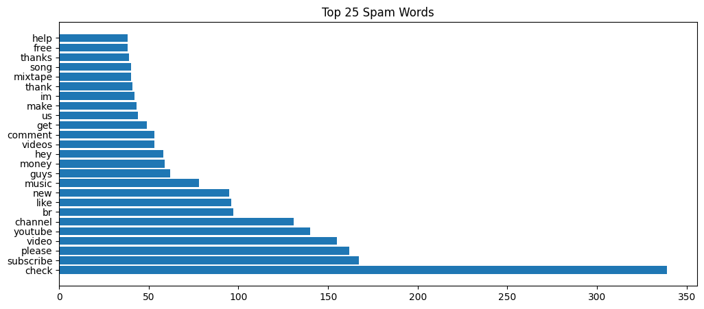

# Youtube SPAM comments detection using NLP pipeline 

Spam is unsolicited and unwanted comments sent electronically whose content may be malicious. The danger could be: exposure of pravicy, a fraud, or a virus,etc. It is a major problem for email and mobine phone users, and it is a growing problem for social media users like Youtube users. We need a solution to detect spam comments. Before that, we need to understand what kinds of Youtube author leave the spam comments most? what are the common words and pattern in the Youtube spam comments? Is it any possible for us to build a model to detect spam comments?  

## Dataset description

The dataset is from [kaggle datasets: Youtube SPAM Classified-comments](https://www.kaggle.com/datasets/goneee/youtube-spam-classifiedcomments?select=Youtube03-LMFAO.csv). It contains 5 csv files with a total of 1956 Youtube comments. The dataset is a collection of more than 1615 Youtube authors. It is a public available dataset for research. The data is labeled, which means each message is labeled as spam or ham. Original dataset has some nosisy information, e.g. missing value in date, and some comments are not in English and unknowd words. The dataset need to be cleaned and preprocessed for further analysis.

## Data exploration
To understand the dataset, we first look at the distribution of spam and ham comments. The dataset is quite balanced, with 56% (951 cases)
of comments being ham and 44% (760 cases) being spam. 

## Who leave the most spam comments, should be flaged warning for Youtube users? When are the spam comments more likely to be posted?

In this dataset, we can see Shadrach Grentz,5000palo are the top 2 authors who have the most comments. Among all the authors,  Shadrach Grentz, Hidden Love, LuckyMusiqLive, etc. leave the most spam comments. 

Surprisingly, the spam comments are more likely to be posted during/near the weekend, and the spam comments are more likely to be posted during the late afternoon and night.

## What are the common words in the Youtube spam comments, where users should be careful?

What are the difference of words used in spam and ham comments? We use wordcloud and bar chart to visualize the most frequent words in spam and ham comments. 

The wordclouds show that spam comments tend to use more words like “check”, “subsribe”, “channel”, “money”, "ike” etc. Those texts urge the receiver to take action.

In comparison, for the ham word cloud and bar chart, those neutral verb words like “song”,”love”,”like”,”video” etc. are used mostly, more about sharing and enjoying the video.

## Is it any possible for us to build a model to detect spam comments? 

### split the dataset into training and test set

 To build a prediction classification model, here firstly converted the label to binary, 1 for spam and 0 for ham. Then, we split the dataset into training and test sets. The training set contains 80%  comments and  the test set contains 20% comments. 

### Feature engineering

The model is built using an NLP pipeline. The pipeline includes: tokenization, stop word removal, and stemming. Experiments on different ways to do feature engineering, including TF-IDF, word2vec, and doc2vec. TF-IDF is used to convert the text to a vector of numbers. Word2vec is a method to convert words to vectors. Doc2vec is a method to convert documents to vectors.

### model selection
The model is trained in RandomForestClassifer. The model is evaluated using F1 score, precision, and recall. As this is a binary classification problem, and the dataset is balanced, we also look at the confusion matrix and visualize it.

### model evaluation
There are three models trained based on different feature engineering methods. The model trained using TF-IDF has the highest F1 score (90%), precision (95%), and recall (83%) on test dataset.This model is saved as a pickle file for future use. The model trained using word2vec has the second highest accuracy (84%), precision (89%), and recall (74%). The model trained using doc2vec has the lowest highest accuracy (67%), precision (78%), and recall (44%). 

_Fig: confusion matrix for the model trained using TF-IDF_

